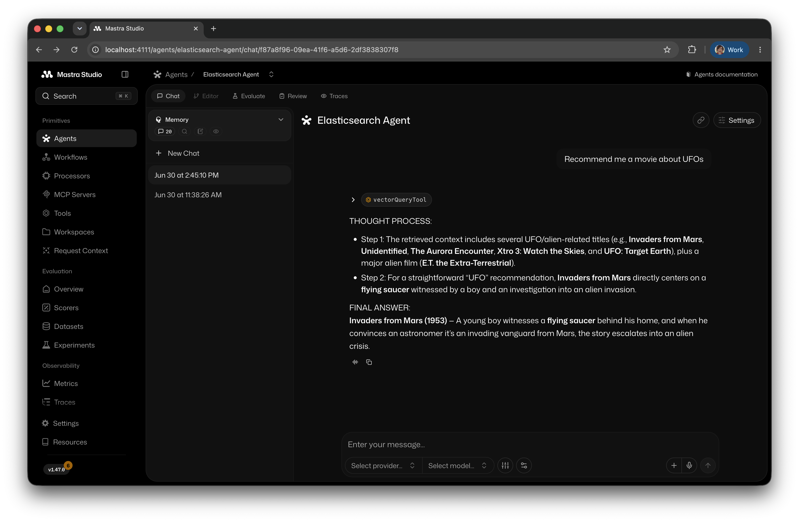

# Even TS Agents Need Retrieval!

This is a simple Agentic RAG example that uses [Mastra](https://mastra.ai/) framework with the official
[@mastra/elasticsearch](https://www.npmjs.com/package/@mastra/elasticsearch) package.



This code example is based on the article [How to build agentic AI applications with Mastra and Elasticsearch](https://www.elastic.co/search-labs/blog/build-agentic-ai-applications-mastra-elasticsearch) published in Elasticsearch Labs of [Elastic](https://www.elastic.co/). It is presented as part of the talk **Even TS Agents Need Retrieval!** at [TypeScript AI](https://luma.com/tsaiconf).

## Key Components

Specifically, the repository contains the following elements:

1. A simple retrieval agent, named *Elasticsearch Agent* to retrieve relevant documents from Elasticsearch.
2. A simple workflow *Movies Workflow* which makes movie recommendations using the Elasticsearch Agent and approve the suggestions.
3. 

## Getting Started

Install the dependencies of the project using:

```bash
npm install
```

Before executing the Mastra project, we need to insert some embeddings in Elasticsearch.
We need to configure the `.env` file copying the structure from the `.env.example` file.
We can generate a new `env` file as follows:

```bash
cp .env.example .env
```

We can edit the `.env` adding the missing information:

```
OPENAI_URL=https://my-deployment.openai.azure.com/openai/v1
OPENAI_API_KEY=MyRandomOpenAIKey

ELASTICSEARCH_URL=https://my-es-deployment.es.com:443
ELASTICSEARCH_API_KEY=MyRandomESKey
ELASTICSEARCH_INDEX_NAME=scifi-movies
```

This project example uses Azure hosted OpenAI as embedding service, this means you need to provide the deployment url via `OPENAI_URL` along with an API key using the `OPENAI_API_KEY` env variable.

The embedding model used in the example is [text-embedding-3-small](https://developers.openai.com/api/docs/models/text-embedding-3-small) from OpenAI, hosted in Microsoft Azure. Specifically this model has an embedding dimension of 1536.

To generate the answer we used the [openai/gpt-5-nano](https://developers.openai.com/api/docs/models/gpt-5-nano) model to reduce the costs.

## Elasticsearch

If you already have an Elasticsearch instance running, you can specify the `ELASTICSEARCH_URL` and
the `ELASTICSEARCH_API_KEY`. If you don't know how to create an API key, you can refer to [this guide](https://www.elastic.co/docs/deploy-manage/api-keys/elasticsearch-api-keys).

If you don't have an Elasticsearch server available, you can activate a free trial on 
[Elastic Cloud](https://www.elastic.co/cloud) or install it locally using the [start-local](https://github.com/elastic/start-local) script:

``` bash
curl -fsSL https://elastic.co/start-local | sh
```

This will install Elasticsearch (and [Kibana](https://github.com/elastic/kibana)) on your computer and generate an API key.

The API key will be shown as output of the previous command and stored in a `.env` file in the `elastic-start-local` folder.

## Create the scifi-movies index

We provided a default `scifi-movies` name for the index (`ELASTICSEARCH_INDEX_NAME`), since in this project we are
going to use a dataset of [500 sci-fi movies](data/500_scifi_movies.jsonl). If you want, you can use an alternative dataset.

Before executing the project, we need to index the embeddings into Elasticsearch.

The [src/utility/store.ts](src/utility/store.ts) is a provided script that ingest the [data/500_scifi_movies.jsonl](data/500_scifi_movies.jsonl) file in Elasticsearch, using OpenAI API to generate the embeddings.

You can run the following command:

``` bash
npx tsx src/utility/store.ts
```

You should see an output as follows:

```
 Created index: scifi-movies
🚀 Starting ingestion of 500 movies from 500_scifi_movies.jsonl...
Ingesting ░░░░░░░░░░░░░░░░░░░░░░░░ 1/500 (0%) | ok:1 | fail:0 | chunks:1 | eta:19m 33s | current:Capricorn One
Ingesting ░░░░░░░░░░░░░░░░░░░░░░░░ 2/500 (0%) | ok:2 | fail:0 | chunks:2 | eta:10m 32s | current:Doghouse
Ingesting ░░░░░░░░░░░░░░░░░░░░░░░░ 3/500 (1%) | ok:3 | fail:0 | chunks:3 | eta:7m 33s | current:Dinocroc
Ingesting ░░░░░░░░░░░░░░░░░░░░░░░░ 4/500 (1%) | ok:4 | fail:0 | chunks:7 | eta:6m 10s | current:Back to the Future
Ingesting ░░░░░░░░░░░░░░░░░░░░░░░░ 5/500 (1%) | ok:5 | fail:0 | chunks:9 | eta:5m 14s | current:The Projected Man
Ingesting ░░░░░░░░░░░░░░░░░░░░░░░░ 6/500 (1%) | ok:6 | fail:0 | chunks:11 | eta:4m 41s | current:I, Robot
...
✅ Ingestion complete in 1m 46s. Success: 500, Failed: 0, Chunks: 693.
```

## Simple example query

One documents have been added to the index, the [src/utility/query.ts](src/utility/query.ts) script provides an example vector search with simple lexical filtering against the Elasticsearch index, using OpenAI API to generate the embeddings.

To execute, run the following command:

``` bash
npx tsx src/utility/query.ts
```

With the sample query `Sci-fi movies with a strong female lead`, it will generate results similar to the following:

```
✅ Index scifi-movies exists
✅ Embedding generated for query "Sci-fi movies with a strong female lead"
✅ 4 results found for query "Sci-fi movies with a strong female lead"
[1] Title: Barbarella, Director: Roger Vadim, Score: 0.703912
[2] Title: Barbarella, Director: Roger Vadim, Score: 0.703912
[3] Title: Barbarella, Director: Roger Vadim, Score: 0.6644496
[4] Title: Barbarella, Director: Roger Vadim, Score: 0.6644496
```

## Start the project example

To start the project you an execute the following command:

```shell
npm run dev
```

Open [http://localhost:4111](http://localhost:4111) in your browser to access [Mastra Studio](https://mastra.ai/docs/getting-started/studio). It provides an interactive UI for building and testing your agents, along with a REST API that exposes your Mastra application as a local service. This lets you start building without worrying about integration right away.

We provided an [Elasticsearch Agent](src/mastra/agents/elasticsearch-agent.ts) that uses the [createVectorQueryTool](https://mastra.ai/reference/tools/vector-query-tool) function by Mastra as tools to be passed to the LLM for semantic search over Elasticsearch.

The agent tool uses the following prompt:

```
You are a helpful assistant that answers questions based on the provided context.
Follow these steps for each response:

1. First, carefully analyze the retrieved context chunks and identify key information.
2. Break down your thinking process about how the retrieved information relates to the query.
3. Draw conclusions based only on the evidence in the retrieved context.
4. If the retrieved chunks don't contain enough information, explicitly state what's missing.

Format your response as:
THOUGHT PROCESS:
- Step 1: [Initial analysis of retrieved chunks]
- Step 2: [Reasoning based on chunks]

FINAL ANSWER:
[Your concise answer based on the retrieved context]ß

Important: When asked to answer a question, please base your answer only on the context provided in the tool. 
If the context doesn't contain enough information to fully answer the question, please state that explicitly and stop it.
Do not add more information than what is present in the retrieved chunks.
Remember: Explain how you're using the retrieved information to reach your conclusions.
```

You can click on the `Mastra Studio > Agents` menu and select the `Elasticsearch Agent`. You can chat with the agent using the UI.
For instance, you can ask information regarding the sci-fi movies with a question as follows:

```
Find movies about UFOs.
```

This will trigger the `vectorQueryTool` tool that will execute a vector search in the `scifi-movies` index of Elasticsearch retrieving the relevant chunks (i.e. documents). The retrieved chunks will be added to the previous prompt and passed to LLM that will generated the final answer.

## Learn more

To learn more about Mastra, you can read the [documentation](https://mastra.ai/docs/) page. 

For Elasticsearch, you can visit the reference page [here](https://www.elastic.co/docs/reference/elasticsearch). 


